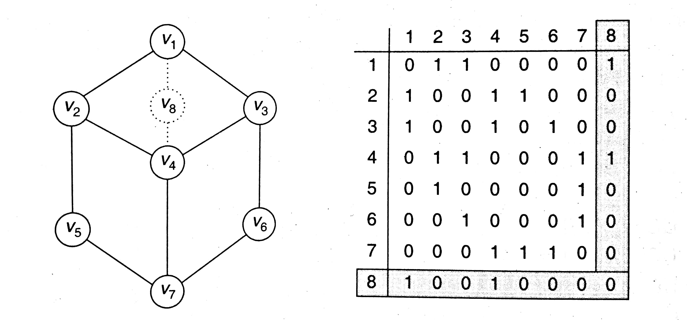

# Matrix Representation of Graph

In matrix representation of graph, graph is represented with `n X n` matrix, in order to store a graph of `n` vertices. For undriected graph, the transpose of the matrix is same, and for directed graph, transpose of the matrix is not necessarily the same.

# Undirected Graph

To represent an undirected graph, we set each index of `from vertix` to `to vertix` to `1`.

## Insert Vertex

## Insert Edge

## Delete Vertex

## Delete Edge

## Implementation

- Java: [Ugraph.java](./Ugraph.java)

# Directed Graph
