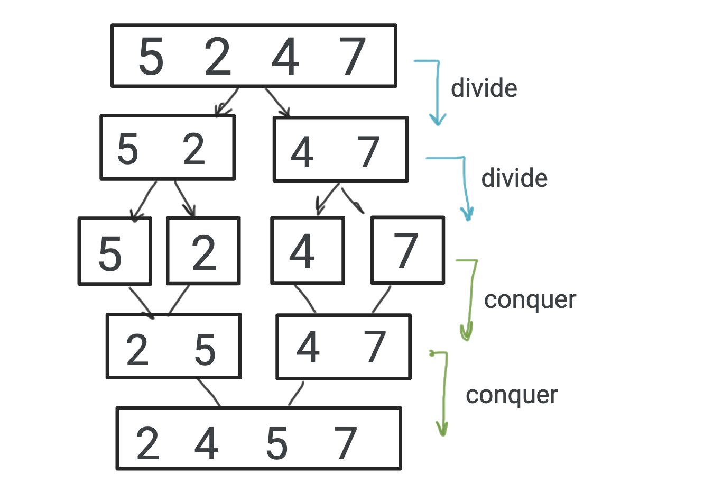

# Merge Sort

Merge sort follows **divide and conquer** approch. Merge sort use 3 mejor step to solve the algorithm. They are-

- **Divide** the n-element sequence to be sorted into two subsequence of n/2 elements each.
- **Sort** the subsequence recursively using **merge sort**.
- **Merge** the sorted subsequence to produce the sorted answer.

## Algorithm

### Input:
An array 'A' with n-elements.

### Output:
A permutation(reordering) of the input sequence.

### Steps:
```
// Merge procedure
Merge (A,p,q,r)
    Copy left subarray into L[]
    Copy right subarray into R[]
    L[last] = infinity
    R[last] = infinity
    i=j=0
    For (k=p to r)
        If(L[i] <= R[j])
            A[k] = L[i]
            i++
        Else
            A[k] = R[j]
            j++
        EndIf
    Endfor
EndMerge

// Merge sort procedure
MergeSort(A,p,r)
    If(p<r)
        q = base((p+r)/2)
        MergeSort(A,p,q)
        MergeSort(A,q+1,r)
        Merge(A,p,q,r)
    EndIf
EndMergeSort

Stop
```

## Visualization



## Analysis


## Code

- Java: [click here](./MergeSort.java)